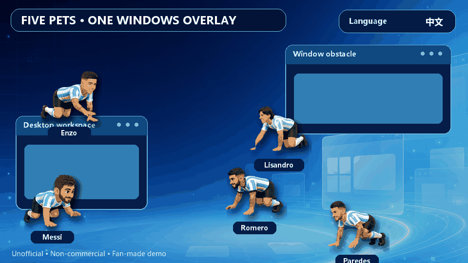

# Argentina Player Desktop Pets

> Unofficial, non-commercial fan-made desktop animation project for Windows.

Animated desktop companions inspired by five Argentine football players:

- Lionel Messi
- Enzo Fernández
- Cristian Romero
- Lisandro Martínez
- Leandro Paredes

This project is not affiliated with, endorsed by, sponsored by, or officially
connected to any featured player, the Argentine Football Association (AFA),
FIFA, any football club, or any commercial sponsor.

## Features

- Independent movement with automatic separation and collision avoidance
- Screen-edge and ordinary-window obstacle handling
- Manual control for one selected character using arrow keys or `W/A/S/D`
- Individual visibility controls from the system tray
- Chinese and Spanish speech options for Messi's collision bubble:
  - 中文：`给你俩窝窝`
  - Español: `¿Qué mirás, bobo?`
- Transparent, always-on-top overlay that does not block normal mouse input

## Run

Download the latest ZIP from the repository's **Releases** page, extract the
archive, and double-click `start-five-pets.cmd`.

The `dist\assets` folder must remain next to `dist\ArgentinaFivePets.exe`.

## Controls

Right-click the program icon in the Windows system tray:

- `Manual Controller...` — select and manually move a character
- `Players` — enable or disable each character
- `Language / 语言` — choose `中文` or `Español`
- `Pause / Resume` — pause or resume movement
- `Scatter Now` — immediately separate the active characters
- `Exit` — close the overlay

## Build

Run `build.ps1` on Windows. The script uses the C# compiler included with the
Windows .NET Framework and copies the required assets into `dist`.

## Legal and rights notice

Please read [LEGAL.md](LEGAL.md) before downloading, redistributing, modifying,
or publishing this project.

The source repository is provided for transparency and personal evaluation.
No license is granted for commercial exploitation of any featured name,
likeness, visual asset, trade dress, trademark, or other third-party right.

## 中文说明

这是一个非官方、非商业的 Windows 球迷桌宠项目，与相关球员、阿根廷足协、
FIFA、任何俱乐部或赞助商均无隶属、授权、代言或合作关系。

托盘菜单中的 `Language / 语言` 可以切换梅西碰撞气泡：

- 中文：`给你俩窝窝`
- 西班牙语：`¿Qué mirás, bobo?`

公开、转载、修改或分发前请阅读 [LEGAL.md](LEGAL.md)。
